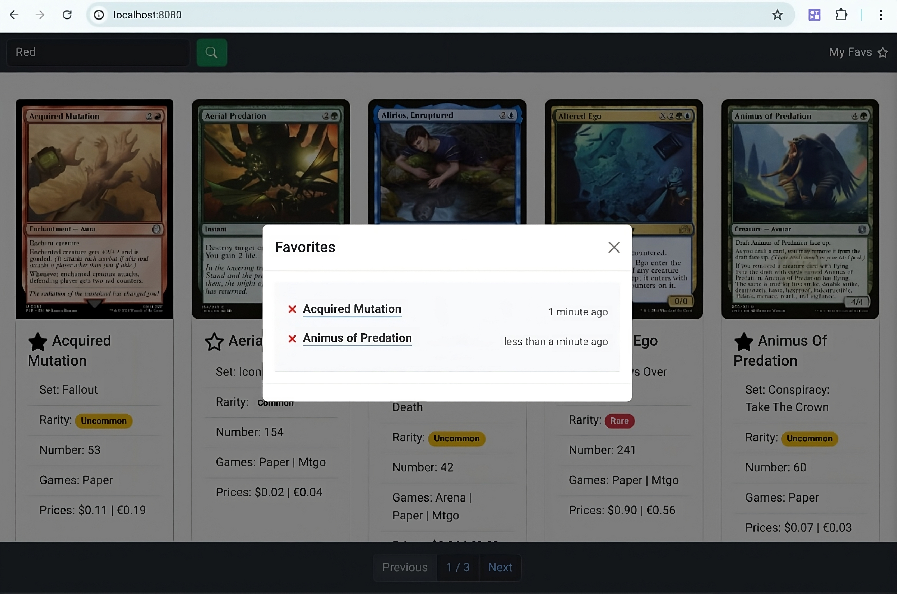

# # Trading Game Cards MVP

This is a **high fidelity (simple but fully functional)** trading game cards MVP built with Typescript and Node.js.

The goal of this project was to create a simple but fully functional and testable MVP to showcase a robust starting point for early stage startups loking to get a head start on their next big project. 
<br/>

It structured with a monorepo which features a React frontend, a vanilla HTML/CSS/Javascript frontend, and a Node.js backend, all of which share common artifacts and code like an OpenAPI 3.x REST API specification



## Features & Highlights

> See it in action at [trading-game-cards.vercel.app](https://trading-game-cards.vercel.app)

- A PostgreSQL database with data migrations support
- Externalized configuration via environment variables
- Utilises HTTP and Redis caching
- A well designed and documented REST API using the OpenAPI 3.x specification
- First class support for TypeScript and pervasive type safety
- Modular architecture using a monorepo
- Modern integration testing with TestContainers
- Dockerized development and execution with Docker Compose and a Dockerfile

## Technology Stack

### Backend
- Typescript
- Node.js
- Express
- PostgreSQL
- Drizzle ORM
- Redis

### Frontend 
- Typescript
- React
- HTML/CSS
- Bootstrap
- Tailwind CSS
- Parcel

### CI/CD, Testing, and Packaging
- Docker
- Mocha / Chai
- Github Actions
- TestContainers


## Wanna Take It For A Local Spin?

1. `[Preferred]` Run the app locally - requires [Docker](https://docs.docker.com/get-docker/)
<br/>
Execute the following commands and follow the prompts:

    ```bash
    git clone https://github.com/johnnyreilly/trading-game-cards.git
    cd trading-game-cards
    docker compose up
    ```     
2. Run integration tests - requires **Node.js** and **PNPM**
    <br/>
    ```bash
    git clone https://github.com/johnnyreilly/trading-game-cards.git
    cd trading-game-cards
    pnpm install && pnpm build

    NODE_ENV=test pnpm --filter entrypoint start:dev
    ```

    Then in another terminal window, run the following command:
    ```bash
    pnpm test
    ```
    
